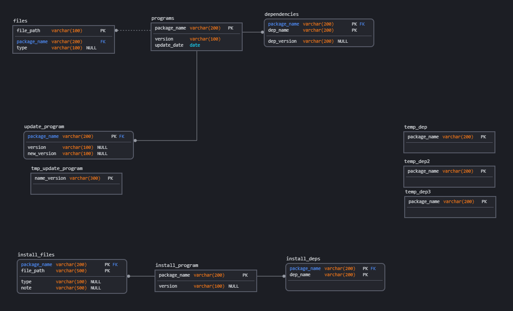

# sql-package-manager
Scripts and database is implemented in PostgresSQL with PL/pgSQL.
The folowing picture represents the database design:

The following features were implemented:
1. Find all programs with a certain length (set to 10) and where the version number matches the regex expression (in my example regex matches the version starting with 0, which means that the program is in alpha version)
2. From table tmp_update_program separate all fields that are in format "package_name" + "-" + "version"
3. Select all programs that need to be upgraded by criterium that program needs to have more than 30 files.
4. Count how many programs waiting to be installed, are going to use existing folders.
5. Find conflicts between packages. Conflict is a file that is already owned by another package.
6. Find all packages that needed to be installed as dependencies for programs that are waiting to be installed.
7. Update table files so that you need to populate the files extension field and in case it is a folder put "folder".
8. Update programs from update_programs to programs and clear unnecessary data
9. Install programs from install_program only if all dependencies are installed and there are no conflict files. Then clear all unnecessary data
10. Find a tree of dependencies for programs that are in install_packages. For this one, I needed to use "PL/pgSQL" which is supported in the PostgresSQL server. PL/pgSQL adds procedural programming features to the queries.
